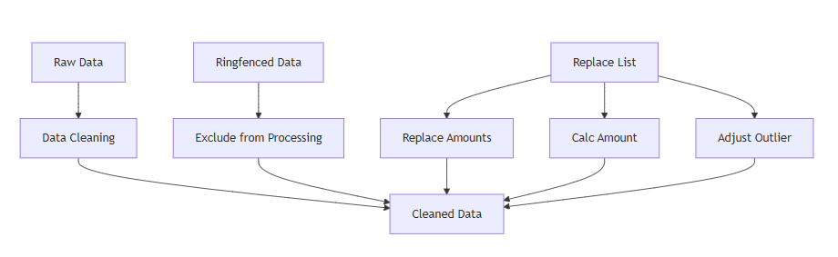

# Report Automation with Power Query
Payroll Reporting Automation | Power Query | Excel | Data Transformation

> Project Overview: 

Designed a Power Query workflow to automate manual payroll reconciliation and reporting processes, reducing processing time, improving data consistency, and minimising manual intervention.

> The Problem: 

- Highly manual, Excel-based reporting process using multiple data sources, VLOOKUPs, and pivot tables.
- Reports rebuilt from scratch each cycle, creating inefficiencies and increasing the risk of errors.
- Time-consuming process, taking approximately 2–3 hours per reporting cycle.

> The Solution: 

- Automated data cleaning, transformation, and reconciliation using Power Query.
- Standardised reporting outputs to improve consistency and accuracy.
- Created a refreshable workflow that reduced manual processing and reporting time.

# Process Documentation
> Key Transformations:
- Removes excluded (ringfenced) records  
- Applies replacement values where provided  
- Calculates a final insured payment value for reporting  
- Amends specific data for record outliers  

> Data Sources
1. **Raw Data**
   - Main dataset containing member and payment data  
2. **Ringfenced List**
   - Records that must be excluded from processing  
3. **Replace List**
   - Contains corrected or updated insured payment values  

> Process Flow Diagram

> Opportunities for Further Development

This project uses a simulated dataset based on real-world payroll reporting structures. The original process was constrained by limited access to source systems, relying on SSRS data extracts that often contained data inconsistencies.

Future enhancements could include:
- Integration with Power BI dashboards for improved reporting and visualisation.
- Direct SQL access to improve data quality and transformation upstream.
- AI-assisted validation and workflow automation to further reduce manual effort.

> About Me

I am a Data Analyst with a background in payroll, pensions, and large-scale financial data environments. I specialise in data cleaning, reporting automation, and workflow optimisation, with a growing interest in intelligent automation and AI-driven analytics solutions.
